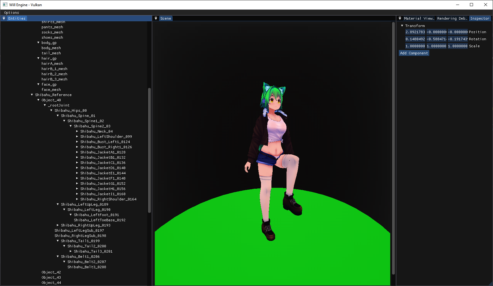

# Will-Engine

This is a hobby game engine created as a personal project with the WILL to make a change (heavily inspired by Xenoblade Chronicles btw). It includes features such as :
- A Vulkan Physically Based Renderer
- A Physically Based Rendering (PBR) Material System
- Unreal Engine inspired BRDF Shading Model
- Deferred Rendering
- Shadow Mapping (Only point light at the moment)
- Call of Duty's Compute Shader Bloom Post-Processing
- Entity Component System (ECS)
- Skeletal Mesh
- Normal Mapping
- Asset Loading

# Getting Started
Visual Studio 2019 or 2022 is recommended. This build works with Windows ONLY and is not fully tested.

<ins>1. Download the repository</ins>

Start by cloning the repository with `git clone --recursive https://github.com/stevenwhatever123/Will-Engine`.

<ins>2.Setting up the project</ins>

This project requires `premake5` for setting up visual studio project and its submodules. If you do not have premake5 installed you could download here: `https://premake.github.io/`.

`glslc` is also required as all shaders code included is compiled targed to my current working machine. You can download it from `https://github.com/google/shaderc` or from the `Vulkan SDK`

1. Run `git submodule update --init --recursive` to download and update all submodules required.
2. Modify the `imconfig.h` file in `libs/imgui` by adding the line `#define VK_NO_PROTOTYPES` in the end of the file.
3. Compile all shader code in `/shaders` folder using the command `glslc.exe [file_name].vert -o [file_name].vert.spv`
4. All file directory is currently hard-coded in the source file, changes on the file path have to be made.
5. Run premake5 with the command `./premake5.exe vs2022` to generate a Visual Studio solution and you should be good to go.

# Project Status

This project is still work in progress in a slow pace. Planning to work on sky light(skybox) and skeletal animation next.

# Screenshots

UI Editor and BRDF Shading

Normal Mapping

Shadow Mapping

Bloom

Skeletal Mesh and Node Hierarchy

Entity Component System

  
Deferred Rendering  

  
PBR Material System  
